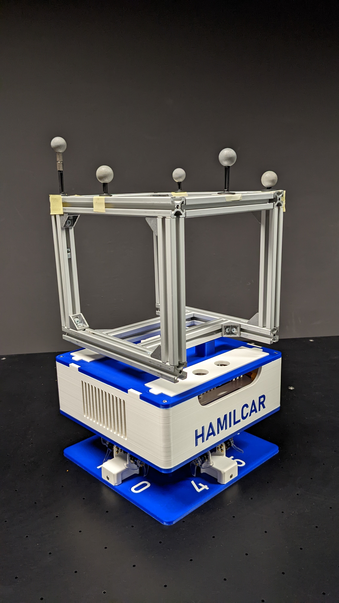
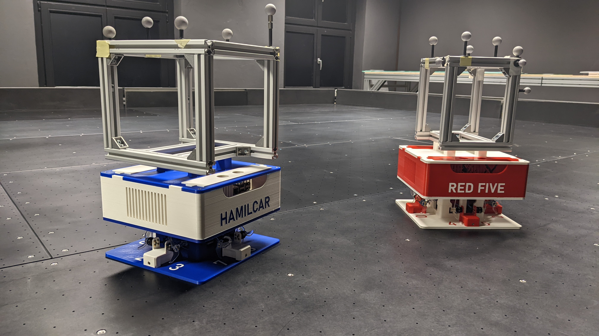

# Hamilcar Class Free-Flyers

> The Hamilcar class is the smaller and older FF class. It makes use of a primarily 3D-printed structure and affordable COTS electronics commonly found in the drone hobby sector.
> Two Hamilcar class FF are currently in operation, the class lead *Hamilcar* and *Red Five*.

<!--figure>
  
  <figcaption>Hamilcar FF in the revised Ausf. B design<figcaption>
<figure-->

<figure>
  
  <figcaption>Hamilcar and Red Five in the revised Ausf. B Design<figcaption>
<figure>

  ---
  Table of Content:
- [Hamilcar Class Free-Flyers](#hamilcar-class-freeflyers)
  - [Payload Module](#payload-module)
  - [Service Module](#service-module)
    - [OBC](#obc)
  - [Propulsion Module](#propulsion-module)    
    - [Propulsion Units](#propulsion-units)
    - [MCMU](#mcmu)

---
  
  
# Payload Module
The payload module (PM) is constructed out of 20x20 Aluminum profiles, providing a versatile and modular structure for attaching payloads. Most commonly, this includes the *Gecko-Docking Mechanism* and the *Arduino KFL Science Payload* used for teaching. OptiTrack markers are also attached to the PM. Magnetic lids on the payload base provide access into the Service Module bay.
  
# Service Module
The Service Module (SM) houses the on-board computer (OBC), on-board power supply and provides additional space for housing electronics. The SM upper features the FF's name printed onto the left and right sides, allowing for easy identification. 
  
## OBC
A *Raspberry Pi 3 B* is utilized as the OBC.
  
# Propulsion Module
zoom zoom
  
## Propulsion Units
  
## MCMU
