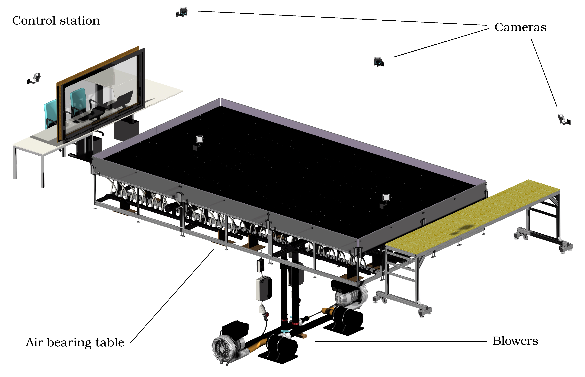

# ELISSA Wiki

This wiki aims to document the ELISSA project and serves as a knowledge base. It is intended to provide 
information to the testbed operators and developers and can serve as an input for documents such as technical notes or other publications. It develops its full potential when the pages are activly maintained. If you find an error or want to add missing information, feel free to edit the page or create a pull request.

The ELISSA system is a laboratory at Institute of Space Systems (IRAS) of the TU Braunschweig. It provides an air bearing
table to allow for a friction less movement of satellite mock-ups with three degrees of freedom (DOF). The driver for the
development is active debris removal and on-orbit servicing. The system aims at hardware in the loop simulations of distributed and small satellite systems. A Robot Operating System (ROS) environment is used to conduct the experiments.

The wiki is divided into different sections and pages providing all the necessary information. You can find this structure on the left side of the page in the sidebar as well:

- Overview over the ELISSA system and its subsystems
  - [System Overview](overview)
    - [Lab Environment](overview#lab-environment)
    - [Freeflyer Classes](overview#freeflyer-classes)
    - [Simulation Environment](overview#simulation-environment)
    - [Experiment Types](overview#experiment-types)
    - [Package Structure](overview#package-structure)
  - [Hannibal Class Freeflyers](hannibal)
  - [Hamilcar Class Freeflyers](hamilcar)
- User guides explaning the operation procedures
  - [Installation](installation)
  - [Run a Simulation](run_simulation)
    - [Single Freeflyer](run_simulation#single-freeflyer)
    - [Multiple Freeflyer](run_simulation#multiple-freeflyer)
    - [Docking Scenario](run_simulation#docking-scenario)
    - [Printing Scenario](run_simulation#printing-scenario)
    - [Mission and Vehicle Management](run_simulation#mission-and-vehicle-management)
  - [Run a Laboratory Experiment](run_laboratory)
    - [Begin Operation](run_laboratory#begin-operation)
    - [Finish Operation](run_laboratory#finish-operation)
    - [Tipps and Tricks](run_laboratory#tipps-and-tricks)
    - [Docking Scneario](run_laboratory#docking-scenario)
    - [Printing Scneario](run_laboratory#printing-scenario)
- Guides for the development of ELISSA software
  - [Developer Guides](dev_guides)
    - [Software and Package Structure](dev_guides#software-and-package-structure)
    - [ROS Structure](dev_guides#ros-structure)
    - [Development Best Practice](dev_guides#development-best-practice)
- Documentation for the Astrobee environment
  - [Astrobee Environment](astrobee)

## About Elissa
Some lines about the project (TBD)

## Further reading 📕
Besides this wiki, there are some documents (slides, thesis and report) describing the testbed:

* [Design and Qualification of Hardware-in-the-Loop Testbed to Experimentally Evaluate Spacecraft Proximity Operations](documents/thesislasse2020.pdf) is a student thsis that provides details regarding the Hanno Freeflyer and the GNC subsystem. [This set of Slides](documents/talklasse2020.pdf) provides a condensed version of aforementioned thesis
* [Experimentelle Charakterisierung der Dockingeigenschaften von Gecko-materialien auf einem Luftlagertisch](documents/rftp2020.pdf) describes docking tests undertaken onboard the testbed.

## Contributing to this Wiki
When adding a page to the document, think about which category is most suitable. Then create a `.md` file in the respective directory and link it to the directorys master file (the file that has the same name as the directory). It is not neccesarry to use this frontend to contribute to the wiki, you can use almost any other texteditor to write markup and `git` to add/commit your files. ** Please make sure to use standard markdown syntax, as this enables automated conversion to `.pdf`**

## Building Documentation
run one of the build scripts within the `pandoc` folder.
