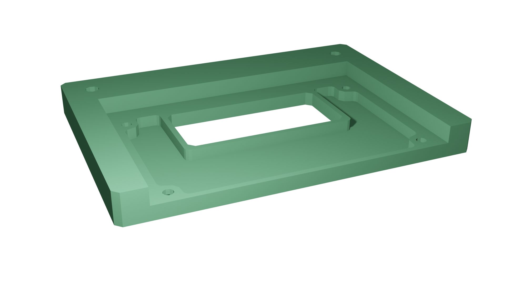
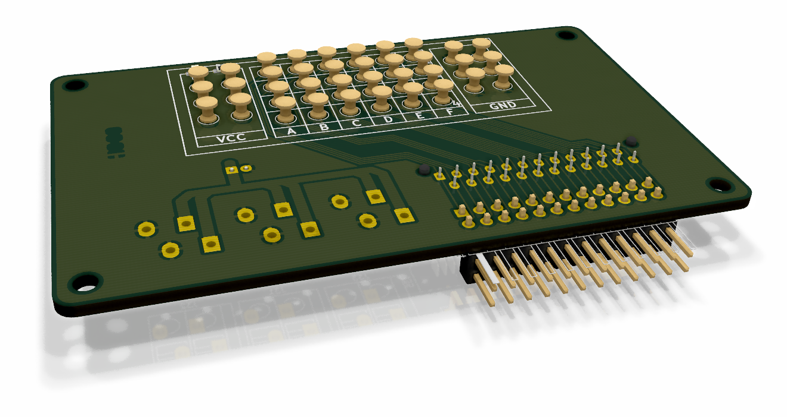

# Hannibal Class Freeflyers

> A redesign of the Hannibal class freeflyers was conducted to reduce the weight and optimize the freeflyers. This new design is used for Pegasus and it is planned to changed Hannibal as well, when it is not needed. 

The Hannibal freeflyer is the second freeflyer used within the ELISSA testbed. It consists of several modules that can easily be stacked upon each other. The figure below shows Hannibal in the printing configuration, consisting of a propulsion module (bottom), the service module (middle) and the printing module (top).  

<!--  -->

## Generic Module Platform

Every module  consists of two frames made of aluminum struts that are connected by four L shaped brackets, which are  referred to as L-brackets. Both frames are connected by eight vertical struts whose length can be chosen freely with regards to the modules purpose. The L-brackets are not only used to connect the struts that make up a module, but also allow stacking multiple modules on top of each other. When stacked upon each other, the lower modules upper L-brackets geometry fits the upper modules lower L-bracket which results in a form fit connection of both modules. In order to increase the mechanical load of the module to module connection, each bracket furthermore contains a magnet. When even more stiFFness is required, both modules can be connected using four M5 bolts.

<!--  -->

While the L-brackets connect multiple modules mechanically, two additional data brackets (from now on called D-brackets) ensure that electrical signals and power can be passed from one module to the other. Signals and power are transmitted via spring loaded contacts mounted to a pcb, which allows to easily exchange modules without having to detach connectors. There are two types of D-brackets, an upper and a lower D-bracket. While both brackets 3D printed structure is the same for the upper an the lower bracket, the pcbs diFFer. The lower data bracket contains aforementioned spring loaded pins while the upper bracket contains the respective counterparts. Both D-brackets PCBs contain 6 power as well as 6 GND contacts that are directly connected to the service modules battery. Furthermore they contain 24 GPIO pins that are arranged in a grid. On the upper D-bracket, these GPIO pins are also exposed to a standard 2.54 mm pin-header. This way signals can be exchanged in between modules in a flexible and protocol-agnostic manner, which keeps the FF modular.

<!--  -->

## Propulsion Module

The propulsion module (PRM) makes use of eight propellers to accelerate the entire FF. This section describes the PRMs detailed design. The module is equipped with eight individual thruster subassemblies, each consisting of a propeller mounted to a bldc that is fixed to a 3D-printed structure, that is mounted to the PRMs frame. 

### Propellers

In order to linearly accelerate hannibal a forece of 6 N is required. Considering that within the proposed design, two propellers contribute to this force, such that each propeller has to contribute a maximum force of 3 N

Due to the rise of RC-drones targeted at the consumer market, there is a plethora of suitable propellers to choose from. Unfortunately there is a lack of detailed and precise information regarding most propellers thrust characteristics. However, American vendor *apc propellers* uses NASAs Transonic Airfoil Analysis Program to assess their propellers performance. *apc propellers APC 4x4E-3* is a propeller with a diameter of $\approx 100$ mm. Its thrust characteristics according to the vendor are depicted in **TBD**. In order provide the needed thrust of 3 N the motor would need to turn at a rate of 17000 rpm which in turn requires for the motor to supply a torque of at least 33 mNm.

### Motors

Similar to propellers, there is a multitude of cots drone bldcs targeted at the consumer market to choose from. However similar as to the propellers, there is a lack of precise documentation. Industrial grade bldcs on the other hand often contain Hall-Sensors or even optical encoders and are shipped along with controllers that allow for precise closed loop control. closed loop control is also possible with cheap hobby ESCs and motors. However, in most cases the relationship of the ESCs input signal to the motors actual rpm is not not known.

For the PRM, *maxon motors EC 22* was considered to be suitable. At a nominal supply voltage of $U=24V$ this motor is able to provide a torque of $48 mNm$ within a speed range of up to $27000$ rpm, which is suFFicient to power the propellers at a rate such that the desired force can be achieved. Each motor is connected to a *1 Quadrant EC* controller on the motor control board.

### MCMU

In order to be able to control the bldc drivers using ROS messages, additional hardware is needed. The MCMU communicates with the SM via a serial interface and constantly receives the target rpm vector via serial communication with the *bldc_driver* node. Whenever there is a new vector, the *MCMU*s *mcu* causes the *pwm* module to generate eight *pwm* signals that provide a setpoint for the *bldc* drivers closed loop rpm controller. Additional control signals that control each of the eight *bldc* drivers are generated by the *mcu*. These include settings such as e.g. the direction of rotation. Each *bldc* driver incorporates an integrated *PI* closed loop controller to control each *bldc*s *rpm*. At the same time, each motors *rpm* is monitored and sent to the *ros* master. 

**TBD** shows a rendering of the finished *pcb* containing a *ATMEGA2560*, eight sockets for mounting the *bldc* drivers as well as connectors to connect the motors. The board connects to the *PRM* modules data bracket for power and communication with other modules.

## Service Module

Recall that the *sm* provides all other modules with power, means of communicating to the *gse* and a platform to perform computation. 

### OBC

In order to perform onboard computation, an *obc* is needed. While currently not much computation power is needed, future application may include vision based navigation or the usage of artificial intelligence. In order to be able to eFFiciently use state-of-the-art high level image processing algorithms, the *sm* contains *nvidias Jetson TX2 Module* which is mounted to a carrier-board that exposes the modules various hardware interfaces. The *TX2* provides wireless communication, has multiple USB interfaces and other low level interfaces such as *GPIOs, I2C, I2S, SPI, CAN*, that are mapped to $2.54$mm pinheaders on the carrier board.

### PCDU

The FF is powered by a *25.9V* *lipo* and three buck down converters provide power at voltages of *3.3V*, $5V$ and $12V$ in order to allow a broad range of components to be used within the FF. The FFs power consumption is measured using a current sensor, which is connected to a mcu. Said mcu is furthermore used to measure the battery voltage, which allows to power off the complete FF, as soon as the battery drops too low.

TBD shows a rendering of the *pcdu* containing three individual buck down converters as well as a current sensor and circuitry to monitor the battery voltage. Both, th current sensors output as well as the voltage monitoring circuities outputs are each filtered by an active second order low-pass filter. In order to communicate to both, the *sm* as well as the sensors the *mcmu* is equipped with an *arduino nano*. The program onboard the *uc* can easily be edited using the *arduino ide* which makes it accessible for future generations of students. Using the *mcmu_drv* node, the *pcdu* can directly communicate to the *ros* master. It publishes the current mainbus voltage and current to the *bat* topic from where it can be accessed within future *ros* nodes to estimate the *FF*s power consumption. A sensor *ACS770LCB-050U-PFF-T* that makes use of the *hall*-eFFect is used to measure the current. It is connected directly to the battery via the *pcdu*s input plug and outputs a voltage $0 V \leq U_I \leq 5 V$ that linearly maps to the mainbus current $0A \leq I_m \leq 50A$ flowing through the sensor. The relation of output voltage and mainbus current can therefore be expressed as:

$$
I_{m}=\frac{50 A}{5 V}U_I
$$

In order to mitigate the eFFects of noise caused by e.g. the buck converters, a second order low-pass conditions the sensors output signal. The analog signal is digitized by the arduinos internal *10 bit* *adc*, which leads to a maximum digitization error of 

$$
I_{err}= 50 \frac{A}{2^{11}}=24.4 mA
$$

